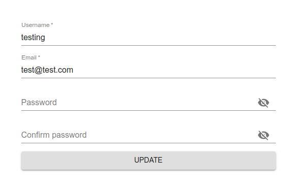

<center>
<image src="assets/zju.png" width="300">


# 本科实验报告

<table>
<tr>
<td>课程名称：</td><td>B/S体系软件设计</td>
</tr>
<tr>
<td>姓名：</td><td>余锦成</td>
</tr>
<tr>
<td>学院：</td><td>计算机学院</td>
</tr><tr>
<td>系：</td><td>计算机系</td>
</tr><tr>
<td>专业：</td><td>计算机科学与技术</td>
</tr><tr>
<td>学号：</td><td>3150101155</td>
</tr><tr>
<td>指导教师：</td><td>胡晓军</td>
</tr>
</table>

</center>

2018年6月28日
<div style="page-break-after: always;"></div>

[TOC]

## 开发文档
### 使用框架
#### 公有框架
- Node.js
    Node.js是一个JavaScript的运行环境。
    本来，JavaScript是一门垄断浏览器前端，运行在浏览器上，可以用于辅助网页设计，使得网页可以具备一定的逻辑处理能力，减轻服务器后端压力的语言。
    JavaScript作为动态解析型语言，其运行效率不会太高。但是作为JavaScript的运行引擎，Chrome浏览器的V8引擎会先把JavaScript代码进行一定编译之后再运行，大大提高了其效率，改善了浏览器运行速度。
    实际上JavaScript使用事件驱动，因此在网页上表现非常优秀，同时这种模式对于一些场景，比如Web服务器开发也是相当适合的。加之V8对JavaScript性能的提升，所以Node.js应运而生。它把V8引擎提取了出来，并且加上本来前端不具备的本地运行库（如文件读写、进程管理等），可以让JavaScript脱离浏览器运行了。
    使用Node.js，我们可以使用JavaScript编写本地执行代码，本次项目设计中，我在前后端均运行了Node.js。后端使用其来搭建我们的服务端，而前端使用其来把浏览器不能直接执行、但是方便开发的JSX代码编译（或者改写）为浏览器能够直接执行的JS代码。
- npm/yarn
    npm是Node.js官方推出的包管理器。通过npm我们可以把第三方Node.js依赖下载下来，让我们可以轻松使用第三方库使用Node.js开发。使用`npm init`可以初始化一个Node.js项目，它会生成一个`package.json`文件用于记录项目信息和依赖关系；使用`npm i`可以手动安装第三方依赖，或者根据`package.json`安装第三方依赖；使用`npm run`可以执行在`package.json`中定义的脚本。
    yarn是一款第三方Node.js包管理器。相对于npm，其缓存了下载过的包，并且下载速度和安装速度较npm有较高提升。所以本项目中主要是使用yarn进行管理的。
    另外npm和yarn都会各自生成一个lock文件(`package-lock.json`或`yarn.lock`)，这两个文件都有缓存各个依赖包之间的依赖关系信息，所以这两个包都应该上传到项目管理中的。
- jwt
    jwt，即JSON Web Tokens，是使用JSON的，用于网络上声明主张的令牌。
    jwt一般用于作为用户登录后的身份认证。用户登陆成功后，服务器颁发一个令牌用于标识用户的身份。每次访问服务器时候带上这个令牌，就可以让服务器知道自己的身份了。
- MongoDB
    MongoDB是一个基于分布式文件储存的NoSQL数据库。
    由于其有很好的分布式解决方案，使用JSON进行数据存储，因而其在Web上使用起来有很大优势，特别适合在Web上进行使用。
- babel
    JavaScript由于其有很好的发展前景和活跃的社区，所以JavaScript的版本迭代非常快，但是Node.js或者浏览器等并未能原生兼容这么快。Babel就是用于把新版本的JavaScript代码编译（翻译）为低版本的JavaScript代码，这样就可以使得程序员使用高版本JavaScript进行开发并且运行在低版本的环境中。同时，Babel也能够提供插件把一些JavaScript的「方言」转为JavaScript语言来运行。比如JSX，或者TypeScript。
#### 前端框架
- React
    React是一款强大的前端开发框架。
    在以前我们开发Web前端的时候，都是使用HTML自带的标签，比如`<a>`表示一个超链接等。如果我们要使用比较复杂的自定义控件，这时候要使用原生标签进行组合，构成一个新的组件。这些新的组件一般使用JS代码进行维护和创建，然后加到已有的DOM中。
    React的主要思想就是对这个过程进行抽象和封装。我们可以把一个空间定义成一个虚拟的DOM，使用一个自己命名的标签，比如`<MyButton>`，其创建管理和维护过程都在JS中，最后完成之后对其进行最终渲染。把它变成一个真正的DOM。这个过程把空间转换成虚拟DOM，方便创建和维护，因为我们可以很简单很直接地控制其状态。而且虚拟DOM的效率要比真实DOM高得多，也在一定程度上简化了程序员为提高效率的优化工作。
    这些虚拟的DOM可以写在JSX中。JSX是为React设计的一个JavaScript方言，是JavaScript的一个超集。它可以很方便直观地使用一个虚拟DOM（直接写成`<MyButton>Text</MyButton>`），使代码更加可读可维护。我们可以使用babel方便地将其转换为浏览器可真实执行的JavaScript代码。
- Webpack
    Webpack是一个前端的模块打包工具。
    在以前前端的开发中，我们把不同模块加入到不同的JS文件中，然后分别嵌入到HTML文件中。这些JS文件不宜太多，因为HTTP1.1是串行加载，会增加加载时间，并且这些文件需要进行压缩，增加了繁琐的步骤。并且在ES6之后，JS增加了模块功能，不同JS文件之间可以很简单的`import`和`export`。使得JavaScript文件变得非常多。但是这样模块化之后非常不方便前端使用。
    Webpack就是提供了一个把模块化后的代码打包成适合前端浏览器使用的代码。把所有模块以及应用打包成一个文件，并进行压缩。这样使得我们可以在写代码时候分模块进行管理编写，同时可以很简单发布成非常适合前端浏览器使用的文件。并且，Webpack有很多loader插件，可以调用babel编译JSX文件，与React结合非常合适。
- MobX
    MobX是一个功能强大的JavaScript状态管理库。
    JavaScript使用事件驱动，这是JavaScript适合Web开发的一个重要特点。并且JavaScript提供了getter和setter函数，可以很方便地对变量读取写入操作进行重载。于是我们面对这样一个需求：希望某个变量在修改之后，其它使用它的对象能够对尽可能细粒度地更新其状态，我们就可以使用getter和setter函数进行监听，实现这样一个功能。
    MobX就是这样一个状态管理库。使用MobX，可以标记一个变量为`observable`变量，在它的值被`action`函数改变之后，那些使用了这些变量的`reaction`函数将会重新运行，进而可以更新其他对象的状态。它跟React结合非常地好，可以很简单地实现一个变量改变值之后，重新渲染这个组件。其效果就是组件监听变量状态，组件更随变量的改变而改变。
- React Router
    React非常适合开发单页面的网页，因为我们可以定义一个`index.html`，然后用JS定义很多个React组件，根据状态来切换组件。
    但是对于多页面的网页，我们如果进入了另一个URL之后，我们不会对每一个路径（或者说页面）都写一个`index.html`然后分别编写React组件。因为如果有些组件是公用的（如导航栏），我们还得引用一下，关键是，我们还必须重新渲染这些公共的组件！这资源和时间消耗都是非常难以接受的。
    所以我们希望，所有页面都是用那个`index.html`和那一批的React组件，我们还把地址栏的URL当做我们的状态，根据地址栏的地址来显示不同的组件！这样好处就是不用为多个组件设计不同的`index.html`，URL地址也可以千奇百怪；更重要的是，公有组件不需要重新渲染，只需要简单请求API更新组件状态，大大提供效率和响应时间！
    React Router正是这样一个帮我们维护URL地址状态的库。它可以根据地址栏判断当前状态选择渲染组件，帮我们控制地址栏跳转（并且更新浏览器历史），以及自动根据地址栏状态变化刷新组件。
    当然实现这样多页面的网页需要后端的兼容：即无论访问哪个URL，都需要重定向到同一个`index.html`，否则刷新之后就会404了。（当然我们可以用URL锚进行实现，但是这样就不优雅了。）
- Material-UI
    Material Design是谷歌的一个设计语言。Material-UI则是把这门设计语言带到了React中，提供了Material中的各种基本控件图标以及配色等，使得React可以轻松实现这种设计语言。
- SupperAgent
    这是一个对前端`fetch`的一个封装，可以用于异步调用API接口。对比`fetch`，它支持中间件扩展，并且支持Method-Override（参考后端的`Method-Override`）。
#### 后端框架
- Express
    Express是基于Node.js平台，快速、开放、极简的Web开发框架。
    Express提供了很方便很强大的路由和中间件支持，使得程序员可以很方便地自定义自己的路由，也可以很方便地定义自己的中间件，或者使用第三方的中间件，从而实现一个效率高、功能强大的Web服务器。
- Mongoose
    Mongoose是Node.js下对MongoDB进行异步操作的对象模型工具。
    可以把Mongoose作为MongoDB在Node.js下的一个驱动。使用Mongoose我们可以很轻松地在Node.js下对MongoDB进行异步操作。并且在Mongoose上，还提供了Schema支持。在MongoDB上实现对Schema要求很松的，我们可以在Collection上储存几乎任意的内容。但是在应用时候，我们还是偏向于可以定义Schema以满足业务需求。
- node-fetch
    在Node.js中，是没有浏览器前端提供的fetch支持的。有了这个依赖包之后我们就可以在Node.js上使用fetch进行异步访问。在我们的后端中主要是用于调用第三方接口获取单词释义、发音和例句。
- Passport
    Passport是Node.js中的一个验证用户身份的中间件。
    在Passport中提供了很多用户验证策略。有了这个中间件，我们可以很轻松地使用Facebook或者Google等公司提供的用户验证接口。不过在本项目中，我们仅仅使用了其LocalStrategy，即使用本地函数进行身份验证。我们的本地身份验证就是使用数据库进行验证。
- cors
    Cors是一个Express中间件，用于允许跨域访问。
    目前的现代浏览器都有一个安全策略，即如果在一个域名（包括端口）想访问另外一个域名的时候，如果目标域名不允许跨域访问，那么这次访问将会被浏览器拒绝。
    我们在前后端调试的时候，前后端分别会打开一个不同的端口，所以这时候想从前端的服务访问后端服务的时候，会被浏览器拒绝掉。所以我们需要在后端打开允许跨域访问。
- Method-Override
    Method-Override允许前端浏览器通过设置HTTP请求头部`X-HTTP-Method-Override`（也可以用其他方式）来重载HTTP谓词。因为不是每个浏览器都兼容HTTP1.1的所有HTTP谓词。这可以给前端一个使用其他HTTP谓词的Fallback。因为我们是使用Restful风格的API的，所以HTTP谓词比较重要，有了这个Fallback之后可以兼容更多情况。
- Body-Parser
    Body-Parser是Express的中间件，可以对Express的请求Body进行预解析。
    由于我们使用Restful风格API，我们使用Json作为前后端通讯的协议。这时候用这个中间件，可以把HTTP请求体预解析为JavaScript的对象。
- connect-history-api-fallback
    这个中间件是为了配合前端的Router而使用的。它会把所有的404重定向到`index.html`。这样以后，除了后端定义路由外，其他路由将会全部交给前端处理。
### 项目结构
#### 前端结构

前端架构较后端复杂一点。
- JSS Styles是使用JavaScript对象实现的组件样式，可以取代CSS。
- React Components负责用户界面的渲染，他们会使用基于全局（使用Provider和decorator实现全局）的JSS Styles来实现样式控制，使用MobX Stores中的变量控制内容，使用Router来选择组件。
    在接受到用户事件（如点击按钮等）的时候，会对事件进行预处理之后，把事件传给MobX或者Router进行进一步处理。
- MobX Stores储存网页的状态数据。在接受到来自React Components的事件之后，会对事件进行进一步处理在，可能会直接修改其状态，或者可能会调用SuperAgent来异步访问API。
    当状态被修改之后，会以最小颗粒触发React Component中的Reaction函数，使React Component在新状态下重新渲染，实现用户界面的更新。
- Router是前端的路由管理。它会监听URL的改变并且作为状态自动选择正确Component进行显示。
- SuperAgent用于异步调用后端接口，并且会尽可能带上用户的令牌。发送一个Request之后，会等待后端的Response。
    在SuperAgent异步调用完成之后，会调用MobX的Action函数修改其中的状态。以触发其进一步机制刷新前端界面。
#### 后端结构

后端结构较前端结构简单，因为它是流水式运行，除了数据库查询以外没有反馈。
- Express Request是客户端的一个请求，是最原始的请求对象。
- Middleware添加的各种中间件，包括Body-Parser对体部进行解析，jwt对用户令牌进行解析，Cors添加跨域访问支持，Method-Override对请求谓词进行修正等，然后根据路由信息交给API处理或者返回静态文件。
- API Handler是处理API请求的，它内部也有路由可以区分各种API。这些API大部分需要异步调用Mongoose来访问MongoDB数据库。在API Handler处理好请求之后，会生成一个Express Response返回给客户端。
- Static Content用来返回静态文件，比如`index.html`和各种图片等，它会读取在文件系统中的这个文件的内容，然后返回一个Express Response返回给客户端。
- Express Response是一个完成好的将会发给客户端的响应。
### 数据库设计
本项目使用了MongoDB。我在MongoDB中设计了几个Collection分别用来储存不同的内容。
- User
    User集合用来储存所有的用户信息。其中包括：
    - email: 电子邮箱
    - username: 用户名
    - hash: 哈希后的密码
    - salt: 哈希密码时候使用的盐

    其中email和username在数据库中都要求检验唯一性。
- WordBook
    WordBook用于记录所有的单词书。其中包括：
    - name: 单词书的名字
    - words: 含有所有单词的数组
    - length: 包含单词的个数

    其中要求words里面的单词不能有重复并且以增序储存。

- Using
    Using用于记录用户使用了哪些单词书。其中包括：
    - user: User集合中的`_id`字段
    - wordbook: WordBook集合中的`_id`字段

    这个是储存了用户与单词书之间的关系，要求两个字段在的组合集合中要唯一。
- Learning
    Learning用于记录用户与单词之间的学习关系。其中包括：
    - user: User集合中的`_id`字段
    - word: 单词
    - state: 学习状态。整数类型，在后端的`Config/index.js`中定义其意义
    - learnDay: 上次学习这个单词的时间。用于按照记忆曲线挑选单词

    这个是储存了用户与单词之间的关系，其中user和word的组合应该在集合中唯一。
- Task
    Task记录用户某一天的背单词任务。其中包括：
    - user: User集合中的`_id`字段
    - words: 用户需要学习的单词数组。这个数组里面每个元素是一个包括两个键的对象，两个键分别为：
        - word: 单词
        - state: 布尔值，表示是否已经完成。用于记录进度。
    - date: 这一个任务是哪一天的。

    这个是每天零点进行重新计算，并且按照记忆曲线进行计算的。其中要求user字段在表中唯一。
### 接口设计
接口设计按照Restful风格设计的。所有API以`/api`前缀开头。
其中Authorization如果是required，即要求请求头部需要有`Authorization`头，其内容为`Bearer ${jwt toekn}`。如果没有该头部会返回401错误。
请求字段中带*号的返回是可选字段。带`:`的字段为URL中的请求字段。带`$`的字段为该字段名字不固定。
- 获取当前用户的简要信息
    |URL:|`/user`|
    |:-|:-|
    |Method:|GET|
    |Authorization:|Required|
    请求字段:
    无
    返回字段：
    |key|value|
    |:-|:-|
    |user|当前用户的信息|
    |user.email|用户的邮箱|
    |user.username|用户的用户名|
    |user.token|新生成的jwt token|
- 注册用户
    |URL:|`/user`|
    |:-|:-|
    |Method:|POST|
    |Authorization:|Optional|
    请求字段:
    |key|value|
    |:-|:-|
    |user|当前用户的信息|
    |user.email|用户的邮箱|
    |user.username|用户的用户名|
    |user.password|用户的密码|
    返回字段：
    |key|value|
    |:-|:-|
    |user|当前用户的信息|
    |user.email|用户的邮箱|
    |user.username|用户的用户名|
    |user.token|新生成的jwt token|
- 获取用户的详细信息
    |URL:|`/user/profile`|
    |:-|:-|
    |Method:|GET|
    |Authorization:|Required|
    请求字段:
    无
    返回字段：
    |key|value|
    |:-|:-|
    |email|用户的邮箱|
    |username|用户的用户名|
    该API可以进行扩展以添加更多字段
- 修改用户资料
    |URL:|`/user/profile`|
    |:-|:-|
    |Method:|PATCH|
    |Authorization:|Required|
    请求字段:
    |key|value|
    |:-|:-|
    |*email|用户的邮箱|
    |*password|用户的密码|
    |*username|用户的用户名|
    返回字段：
    |key|value|
    |:-|:-|
    |email|用户的邮箱|
    |username|用户的用户名|
- 登录
    |URL:|`/user/session`|
    |:-|:-|
    |Method:|POST|
    |Authorization:|Optional|
    请求字段:
    |key|value|
    |:-|:-|
    |email|用户的邮箱|
    |password|用户的密码|
    返回字段：
    |key|value|
    |:-|:-|
    |user|当前用户的信息|
    |user.email|用户的邮箱|
    |user.username|用户的用户名|
    |user.token|新生成的jwt token|
- 查单词
    |URL:|`/word/:word`|
    |:-|:-|
    |Method:|GET|
    |Authorization:|Optional|
    请求字段:
    |key|value|
    |:-|:-|
    |:word|需要查询的单词|
    返回字段：
    |key|value|
    |:-|:-|
    |word|查询到的单词（如果单词不存在返回`null`）|
    |pronunciation|单词的发音|
    |pronunciation.AmE|美音音标|
    |pronunciation.BrE|英音音标|
    |pronunciation.AmEmp3|美音发音音频地址|
    |pronunciation.BrEmp3|英音发音音频地址|
    |defs|单词释义数组|
    |defs[].pos|该释义词性|
    |defs[].def|该释义的中文解析|
    |sams|单词的例句数组|
    |sams[].eng|该例句的英文|
    |sams[].chn|该例句的中文|
    |sams[].mp3Url|该例句的中文发音|
    |sams[].mp4Url|该例句的发音视频|
- 获取所有单词书
    |URL:|`/wordbook`|
    |:-|:-|
    |Method:|GET|
    |Authorization:|Optional|
    请求字段:
    无
    返回字段：
    |key|value|
    |:-|:-|
    |$name|单词书的名字|
    |$name.length|单词书的单词数|
- 获取单词书的单词
    |URL:|`/wordbook/:wordbook/:page`|
    |:-|:-|
    |Method:|GET|
    |Authorization:|Optional|
    请求字段:
    |key|value|
    |:-|:-|
    |:wordbook|需要查询的单词书名|
    |:page|需要查询的页数|
    返回字段：
    |key|value|
    |:-|:-|
    |$word|该单词书该页的单词|
- 获取用户单词书使用情况
    |URL:|`/using/:wordbook`|
    |:-|:-|
    |Method:|GET|
    |Authorization:|Required|
    请求字段:
    |key|value|
    |:-|:-|
    |:wordbook|需要查询的单词书名|
    返回字段：
    |key|value|
    |:-|:-|
    |state|是否正在使用这本书。1代表正在使用，0代表没有使用。该字段可能被扩展|

- 使用单词书
    |URL:|`/using/:wordbook`|
    |:-|:-|
    |Method:|GET|
    |Authorization:|Required|
    请求字段:
    |key|value|
    |:-|:-|
    |:wordbook|需要查询的单词书名|
    返回字段：
    |key|value|
    |:-|:-|
    |state|是否正在使用这本书。1代表正在使用，0代表没有使用。该字段可能被扩展|
- 抛弃单词书
    |URL:|`/using/:wordbook`|
    |:-|:-|
    |Method:|DELETE|
    |Authorization:|Required|
    请求字段:
    |key|value|
    |:-|:-|
    |:wordbook|需要查询的单词书名|
    返回字段：
    无
- 获取今天的学习任务
    |URL:|`/learning`|
    |:-|:-|
    |Method:|GET|
    |Authorization:|Required|
    请求字段:
    无
    返回字段：
    |key|value|
    |:-|:-|
    |$word|单词$word的学习状态，`false`为未学习，`true`为已学习|
- 获取单词的学习状态
    |URL:|`/learning/:word`|
    |:-|:-|
    |Method:|GET|
    |Authorization:|Required|
    请求字段:
    |key|value|
    |:-|:-|
    |:word|需要查询的单词|
    返回字段：
    |key|value|
    |:-|:-|
    |word|查询到的单词|
    |state|单词的学习状态，该字段由后端`Config/index.js`定义|
- 添加学习单词
    |URL:|`/learning/:word`|
    |:-|:-|
    |Method:|POST|
    |Authorization:|Required|
    请求字段:
    |key|value|
    |:-|:-|
    |:word|需要查询的单词|
    返回字段：
    |key|value|
    |:-|:-|
    |word|查询到的单词|
    |state|单词的学习状态，该字段由后端`Config/index.js`定义|
- 更新单词学习状态
    |URL:|`/learning/:word`|
    |:-|:-|
    |Method:|PATCH|
    |Authorization:|Required|
    请求字段:
    |key|value|
    |:-|:-|
    |:word|需要查询的单词|
    返回字段：
    |key|value|
    |:-|:-|
    |word|查询到的单词|
    |state|单词的学习状态，该字段由后端`Config/index.js`定义|
- 直接完成单词的学习
    |URL:|`/learning/:word`|
    |:-|:-|
    |Method:|PUT|
    |Authorization:|Required|
    请求字段:
    |key|value|
    |:-|:-|
    |:word|需要查询的单词|
    返回字段：
    |key|value|
    |:-|:-|
    |word|查询到的单词|
    |state|单词的学习状态，该字段由后端`Config/index.js`定义|
- 不再学习单词
    |URL:|`/learning/:word`|
    |:-|:-|
    |Method:|DELETE|
    |Authorization:|Required|
    请求字段:
    |key|value|
    |:-|:-|
    |:word|需要查询的单词|
    返回字段：
    |key|value|
    |:-|:-|
    |word|查询到的单词|
    |state|单词的学习状态，该字段由后端`Config/index.js`定义|
- 获取一次测试的单词
    |URL:|`/examine/:size`|
    |:-|:-|
    |Method:|GET|
    |Authorization:|Required|
    请求字段:
    |key|value|
    |:-|:-|
    |*:size|测试单词数，默认为30个|
    返回字段：
    |key|value|
    |:-|:-|
    |$word|该次测试是的单词|
### 算法实现
在项目中，没有非常复杂的算法。只有一个我实现的根据记忆曲线安排学习任务的算法稍微有点意思，这里说明一下。
该算法实现非常朴素。首先根据艾宾浩斯遗忘曲线，我们记忆时候应该按照一下时间间隔进行提醒：
1. 5分钟
2. 30分钟
3. 12小时
4. 1天
5. 2天
6. 4天
7. 7天
8. 15天

由于我们的记忆周期是以天进行计算的。所以我最后确定的记忆时间间隔为：
1. 1天
5. 2天
6. 4天
7. 7天
8. 15天

根据这个记忆周期，可以推算出，在每天都背诵的情况下，每天的单词等分为六个部分，1天前的单词，2天前的单词，4天前的单词，7天前的单词，15天前的单词和今天的单词。
为了避免某天没有学习导致下一天学习量增加，要求位于每个阶段的词数不能超过每天的新词数。如果昨天有新单词没有学习，今天不再安排新词。
首先先在配置文件定义一些可以设定的常量
```js
// Learning states.
export const LEARNING_STATES = {
  NO_LEARN: 0,
  START_LEARNING: 1,
  // LEARNING is floating pointer number between START and FINISH.
  FINISHED: 7,
};

// How many days should one learning state state stays
// It should match LEARNING_STATES
export const LEARNING_DAYS = {
  2: 1, // For instance, today I learn a word and it becomes state2,
        // then it should appear the next day and let me learn it to state 3
  3: 2,
  4: 4,
  5: 7,
  6: 15,
};

// How many words to learn a day
export const TASK_NUM = 120;

// How many new words to learn a day.
export const TASK_NEW_WORD = Math.round(TASK_NUM / (LEARNING_STATES.FINISHED - 1));
```

然后实现一个函数用于获取今天的学习任务（伪代码）：
```js
function newWords() {
  let promises = [];
  const {START_LEARNING, FINISHED} = LEARNING_STATES;
  promises.push(
    LearningModel.count({user, state: START_LEARNING, learnDay: {$lt: getDay()}})
      .then(count => {
        if (count > 0) return null;
        return LearningModel.find({user})
      }).then(learnings => {
          if(!learnings) return null;
          let learningWords = learnings.map(({word}) => word);
          return UsingModel.find({user}, {_id: false, wordbook: true});
      }).then(usings => {
          if(!usings) return null;
          let wordbooks = usings.map(using => using.wordbook);
          return WordBookModel.aggregate([
            {$match: {_id: {$in: wordbooks}}},
            {$unwind: '$words'},
            {$match: {words: {$nin: learningWords}}},
            {$sample: {size: TASK_NEW_WORD}}
          ]);
      }).then(newWords => {
          if(!newWords) return;
          newWords = newWords.map(({words}) => words);
          for (let word of newWords)
            promises.push(new LearningModel({
                word, user, learnDay: getDay()
            }).save());
            words.push(...newWords);
      });
  );
  for (let state = START_LEARNING; state < FINISHED; ++state)
    promises.push(LearningModel.find(
        {user, state, learnDay: {$lte: getDay(LEARNING_DAYS[state])}},
        {_id: false, word: true}).limit(TASK_NEW_WORD)
      .then(stateWords => words.push(...stateWords.map(({word}) => word)))
    );
  return Promise.all(promises)
    .then(() =>
      words.filter((value, index, self) => self.indexOf(value) === index)
        .reduce((total, word) => {
          total[word] = false;
          return total
        }, {})
    );
}
```
主要实现思路是先判断是否还有新词未学习。如果没有，则找出用户使用中的单词本和已经学习的单词，从学习中的单词本中随机找出未学习的指定个数的单词，然后加入用户的单词书中，最后调整一下格式之后返回调用者。
调用者会把单词添加到今天任务中然后返回给用户。
## 使用手册
### 部署手册
- 获取源码（如果已经有源码，可以跳过这一步）
    1. 从git克隆项目
        ```shell
        git clone git@github.com:yujincheng08/CiCi.git
        ```
    1. 获取前后端代码
        ```shell
        cd CiCi
        git submoudle update --init backend frontend
        ```
- 下载依赖
    ```shell
    npm i
    ```
    或者，使用推荐的yarn进行安装
    ```shell
    yarn
    ```
- 导入单词书
    如果数据库是全新的，这时候需要导入默认的三本单词书。
    ```shell
    ```
- 启动服务端
    ```shell
    npm start
    ```
    或者，使用推荐的yarn
    ```shell
    yarn start
    ```
    此时服务端会监听在`[::]:3000`，或者如果没有IPv6环境的话，`0.0.0.0:3000`。
- 对服务端配置
    1. 配置端口
        如果需要配置端口，可以直接在运行前配置环境变量`PORT`即可，比如监听在1155端口：
        ```shell
        PORT=1155 yarn start
        ```
    1. 配置其他
        其它可配置的选项在`backend/Config/index.js`文件中。其中包括：
        - `secret`: express-session中的秘钥
        - `mongodb`: MongoDB的地址和数据库名
        - `getDay`: 某一天开始的时间戳计算。可以通过修改函数修改「一天」的开始时间（默认00:00）。
        - `LEARNING_STATES`: 学习状态的定义。可以定义未学习、学习开始的标志和学习结束的标志位。不建议修改未学习和学习开始标志，因为还需要修改前端相关代码。修改学习结束可以修改一个单词学习次数。
        - `LEARNING_DAYS`: 每个学习阶段之间的间隔时间。修改这个可以修改两个学习阶段之间的间隔时间。可以通过修改它来使用其他学习模型。
        - `TASK_NUM`: 一天学习的单词数量。
        - `TASK_NEW_WORD`: 一天的新单词量。有默认的计算模型，不建议修改。
        - `frontend`: 前端静态文件相对地址。如果前端静态文件部署在其他位置可以修改这个变量。也可以制定环境变量`FRONTEND`来动态指定。
        - `port`: 后端监听地址。可以修改默认端口（3000），也可以通过制定环境变量`PORT`来动态制定。
### 用户手册
- 主页
    
    在部署好网站之后，打开网站之后可以看到主页如上图所示。
    其中左侧的四个图标都可以点击进入不同页面。
    点击左上角的菜单图标
    
    可以展开左侧导航图标
    
    当然可以点击上面的小三角收起菜单导航。
    
    可以看到第一个图标是进入主页。后面三个图标分别是学习、测验和单词书。
    这三个图标跟主页上显示的三个卡片功能是一样的。
    
    当然这三个图标也是可以点的。
    在没有登录的情况下，点击测验和学习会自动进入登录注册界面。
    在主页右上角，可以看到一个人形图标，点开可以展开账号管理菜单：
    
    在没有登录的情况下，是注册和登录页面。
    页面右上方还有一个搜索栏，可以搜索单词。
    
- 登录注册
    登录页面如下：
    
    登录失败会显示提示
    
    表单上方可以在登录与注册页面之间切换。
    切换到注册页面如下：
    
    如果用户名或者邮箱已经被使用也会提示错误:
    
    登录和注册时候，都要求用户名和密码超过6位。并且要求邮件地址符合格式。
    
    另外在注册登录的时候，密码可以点击右边的图标切换显示和隐藏
    
- 单词查询
    在任意页面上方的应用栏都可以输入搜索单词。
    
    比如搜索单词`hello`之后，会显示：
    
    在这个页面中，标题音标后有个小喇叭，点击之后可以播放对应的发音：
    
    此外在发音后有一个图标：
    
    可以把单词添加到学习计划中，添加成功之后，或者单词本来就在学习中，那么会显示另外一个图标：
    
    此外后面的例句列表也是可以点击的，点击之后会播放例句的读音。
    
- 单词本
    进入单词本之后，可以看到所有的单词本：
    
    如果已经登录的话，还能显示使用或者弃用单词书的按钮：
    
    
    点击卡片可以查看单词书的所有单词：
    
    单词分页显示，并且可以翻页。如果已经登录的话，还能再标题旁边显示使用或者弃用按钮。
    每个单词都可以点击，点击之后可以进入单词查询结果页面。
- 学习
    在使用单词书之后，可以进入学习页面（如果没有使用任何单词书，将会直接显示学习完成。但是这时候选择单词书之后，可以开始新的单词书。）
    
    下面两个单词分别是认识和学习。如果点击认识，今天不再出现这个单词。如果点击学习，则表示不认识这个单词，今天还会重新出现这个单词。
    上面的是进度条，表示当前已经认识多少个单词：
    
    深色表示已经学习的，浅色表示还需要学习的。
    点击认识或者不认识之后，会出现单词的详细释义：
    
    该页面跟查询单词一样的使用。
    点击下一个则进入学习下一个单词。
    学习完成之后，会出现学习完成的页面：
    
    单词列表同样可以点击，点击进去可以复习单词。
    注意，如果已经开始过学习，那么单词将会添加到今天的学习计划中，比如，在这时候已经完成学习之后，我添加了`hello`这个单词，然后重新打开学习页面：
    
    这时候需要学习新添加的单词了。

    学习单词是从选择的单词书进行随机抽取学习。如果之前还有新单词没有学习，则不会再有新单词，直到新单词学习完成。如果在学习之前添加单词计划，将不会把单词添加到今天的学习计划中，而是覆盖明天的学习计划，明天的新词会变成只有今天新添加的单词。如果在学习之后添加的单词，将会添加到今天的学习计划中。

- 测试
    当学习词汇还没30个或以上的时候，会提示错误：
    
    当学习足够单词数之后，就可以测试单词了。
    
    屏幕上会显示一个单词和四个意思，要从四个选项中选择正确的意思。
    同样小喇叭也是可以点击播放单词的读音
    
    上面的进度条分为三部分：
    
    其中深色为目前答对的单词，浅色的是答错的单词，虚线是待测单词。
    完成之后显示如下页面：
    
    可以查看答错答对的单词。同样可以点击单词进入单词页面进行查看单词意思。但是点击之后再返回又会开始一次新的测试，这是需要注意的。

- 用户信息
    用户信息界面可以在登录之后点击右上角图标:
    
    然后选择Profile进入用户信息页面。
    
    可以在这个页面修改用户的详细信息，如用户名、邮箱和密码等。
    也可以点击右上角页面登出用户。
## 测试
在开发完成之后，我进行了一系列的测试。发现了几个小的BUG。
1. 多单词书抽样单词时候，可能会从不同单词书抽出同样一个单词，需要进行过滤：
    ```diff
    + newWords= newWords.filter( (value, index, self) => self.indexOf(value) === index );
    ```
1. 在没有选择单词书的时候，学习时候会创建空的学习任务导致错误，也需要进行过滤：
    ```diff
    +if (Object.keys(words).length === 0)
    +  return res.json({});
    ```
1. 在学习结束时候，最后一个单词在进入详情之前就跳转到完成页面了。需要在跳转完成时候判断一下：
    ```diff
    -if (learn.finish)
    +if (learn.finish && this.state.step !== 2)
    ```
1. 注册时候密码和确认密码不匹配：
    ```diff
    -if (this.password !== this.confirmedPassword || this.password.length > 0)
    +if (this.password !== this.confirmedPassword || this.password.length === 0)
    ```
1. 注册时候用户名或者邮箱已经被占用的时候，返回的错误格式不一样，其实是手误引起的bug：
    ```diff
    -error: Object.keys(err.errors).reduce((errors, key) => {
    +errors: Object.keys(err.errors).reduce((errors, key) => {
    ```
此外，就没有发现其他问题了。
## 心得和体会
这次开发其实不是我第一次开发BS项目。早在初高中时候就已经为班级搭建过网站了。但是那时候搭建网站跟现在差别非常巨大，不禁感叹Web的发展相当迅速。
首先是框架。我当时使用的是PHP以及前端使用JQuery等框架实现ajax。那时候还是多个php(html)文件加一两个JS的开发模式。而现在，后端PHP已经不常用了，新兴的Express如日中天，后端也可以用JavaScript进行开发了。而且现在前后端分离比以往还要厉害。以前还是使用后端渲染比较多，现在都是使用前端渲染了。并且，前端开发竟然也有了类似编译一样的过程，使用更易读易开发的代码进行开发，然后再汇总成为一个JS文件。熟悉这样一套前端开发的环境就可以花上很多的时间。
其次是路由。以前开发中，路由都是有Nginx或者是Apache等服务器来接管的，一般路由也就说用来表示一下文件路径，有时候重写一下路径可以使得路由更加好看。而现在，程序员可以变得很轻松地管控自己的路由，不仅后端可以调控，前端也可以控制自己的一套路由了。
再次就是JavaScript语言上面的改变。现在JavaScript也是如日中天，在StackOverflow和Github上有着惊人的增长率，社区也变得非常活跃，语言特性上面也是大变样。现在在JavaScript中，由于模块、类、匿名函数等的引入，已经很少写到`function`这个关键字了，而且`let`，`const`和匿名函数更符合广大程序员的直觉，更加方便开发。类的引入使得OO特性更加易于开发。模块的引入也是的闭包不再有需要。引入了`Promise`之后解决了异步调用时候回调地狱问题，而且代码写起来也非常优雅，非常适合异步使用。
MongoDB也是给我给我印象非常深刻的一个数据库。其不再有传统关系型数据库的SQL语言，Schema等特性，而是使用JSON进行数据储存，查询与是使用JavaScript进行查询，不再使用SQL。分布式储存也使得它的性能特别的高。在使用MongoDB的时候，一定要摒弃以前关系型数据库的思维。
而CSS上，引入了`flex`布局之后，也是的CSS写起来更加简单优美，也更加容易适配不同分辨率的屏幕。
总的来说，这次项目设计使我接触到Web开发的比较前沿的技术栈，增加了自己的知识水平，感受到了JavaScript活跃的生命力。不过较为可惜的是，我并没有使用TypeScript进行开发，还不能感受比JavaScript更加优秀的TypeScript超集的开发体验。以后有机会一定要接触一下TypeScript的开发，也借出一下React Native在移动端的优秀表现。